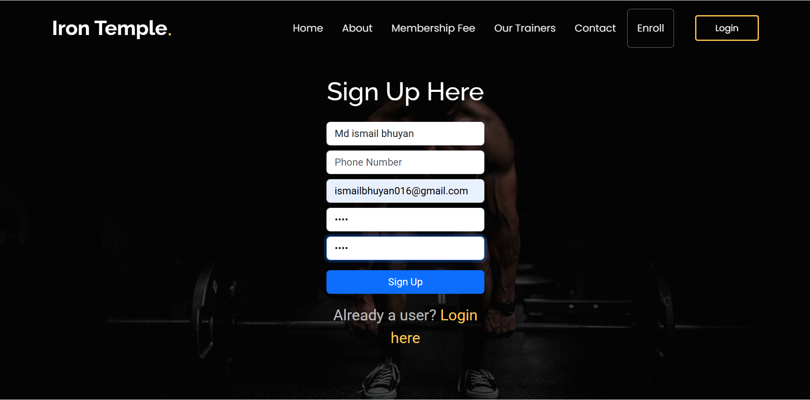
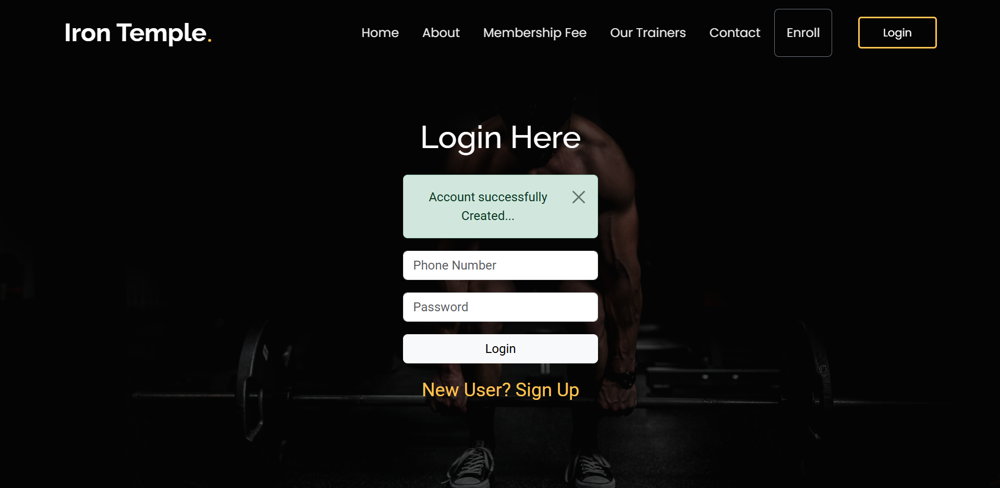
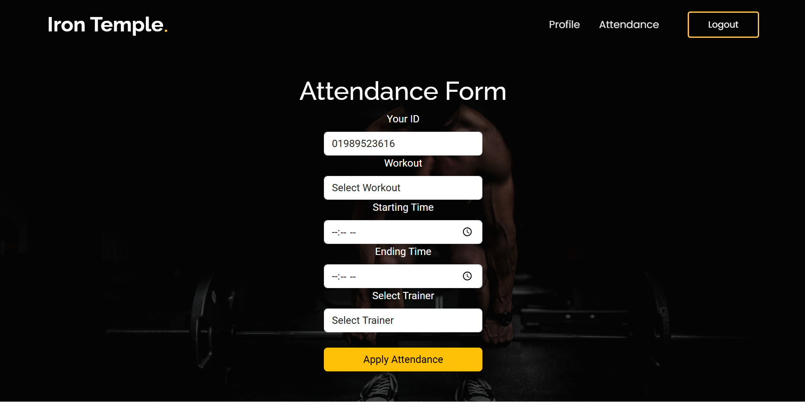
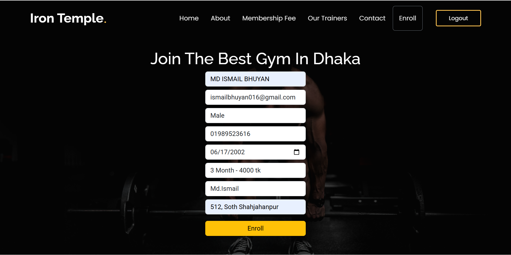
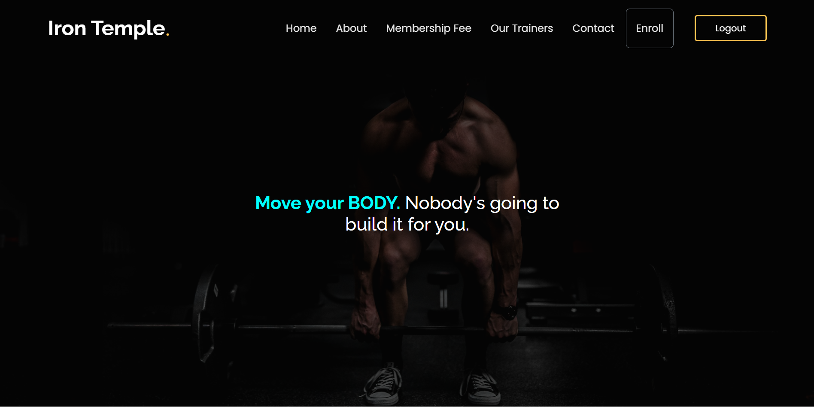
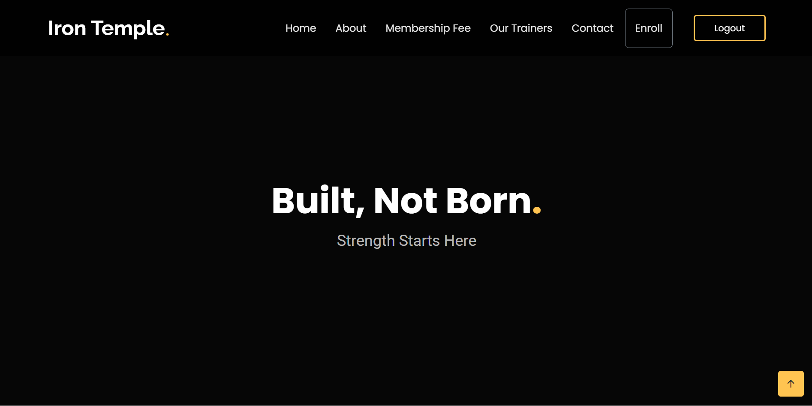
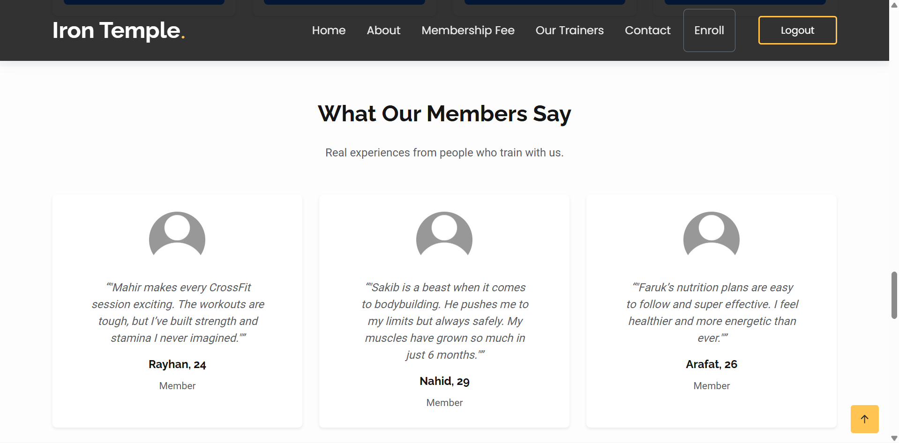
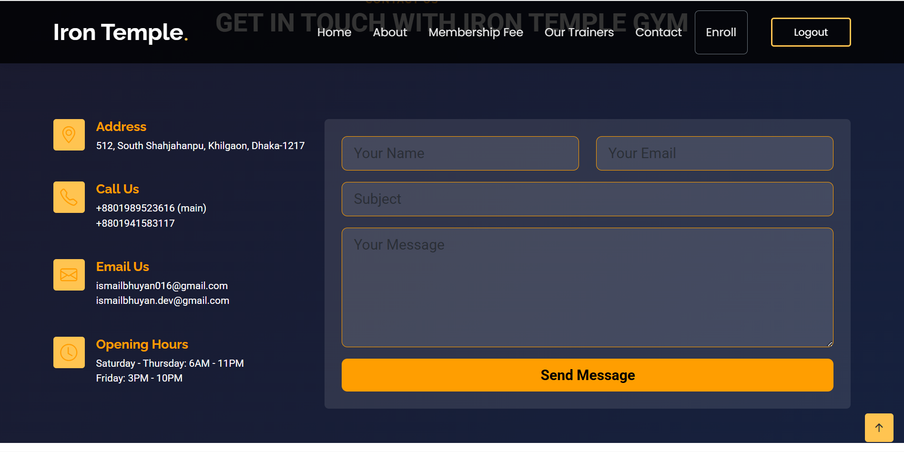

# Iron Temple — Gym Management System (Django)

A full-stack Django web application for managing a gym/fitness club. It provides public marketing pages (home, about, membership fees, trainers, contact), user authentication, member enrollment, attendance tracking, and an admin interface to manage plans, trainers, members/testimonials, and more.

> **Note:** The project folder includes a local virtual environment (`gymenv/`). It is **not** required to run the project and should not be committed to source control.

---

## Table of Contents

- [Features](#features)
- [Project Structure](#project-structure)
- [Requirements](#requirements)
- [Quick Start (Local)](#quick-start-local)
- [Configuration](#configuration)
  - [Environment variables](#environment-variables)
  - [Database](#database)
  - [Email (Contact form)](#email-contact-form)
  - [Static & Media files](#static--media-files)
- [Usage Guide](#usage-guide)
  - [Public pages](#public-pages)
  - [Authentication](#authentication)
  - [Enrollment](#enrollment)
  - [Attendance](#attendance)
  - [Profile](#profile)
  - [Admin panel](#admin-panel)
- [License](#license)

---

## Features

- **Marketing site:** Home, About, Membership Fees, Trainers, Contact.
- **Membership plans:** Dynamic pricing cards driven by the `MembershipPlan` model (`plan`, `price`, optional `color`).
- **Trainer directory:** Cards with photo, phone, specialization, and join date.
- **Authentication:** Sign up, login, logout (Django auth).
- **Member enrollment:** Logged-in users submit personal details, choose a membership plan and trainer.
- **Attendance tracking:** Members log workout type, trainer, start/end time; history is shown on the profile page.
- **Profile dashboard:** View enrollment(s) and attendance history.
- **Contact form with email notification.**
- **Admin interface:** Manage plans, trainers, enrollments, attendance, testimonials/members, contact messages, and user profiles.
- **Media uploads:** User/Trainer images stored under `/Uploads/`.

---

## Project Structure

```
gym_project/
├─ manage.py
├─ requirements.txt
├─ gym_project/ # Project settings/URLs/Wsgi
│ ├─ settings.py
│ ├─ urls.py
│ └─ wsgi.py
├─ gym_app/ # Main app: models, views, urls, admin
│ ├─ models.py
│ ├─ views.py
│ ├─ urls.py
│ ├─ admin.py
│ ├─ context_processors.py
│ └─ migrations/
├─ templates/ # Django templates
│ ├─ base.html
│ ├─ index.html
│ ├─ about.html
│ ├─ fees.html
│ ├─ trainers.html
│ ├─ contact.html
│ ├─ signin.html
│ ├─ login.html
│ ├─ enroll.html
│ └─ profile.html
├─ static/ # CSS/JS/images
└─ Uploads/ # Media (created at runtime)
```


---

## Requirements

- **Python** 3.10–3.13
- **PostgreSQL** 12+
- **Pip** and **virtualenv**
- **Pillow** (for image fields)

Main packages in `requirements.txt`:
- Django `5.2.4`
- psycopg2-binary `2.9.10`
- djangorestframework `3.16.1`
- gunicorn

---

## Quick Start (Local)

```
bash
# 1) Clone the repo and cd into it
git clone <your-repo-url>.git
cd gym_project

# 2) Create & activate a virtual environment
python -m venv .venv
# Windows:
.venv\Scripts\activate
# macOS/Linux:
source .venv/bin/activate

# 3) Install dependencies
pip install -r requirements.txt

# 4) Run migrations
python manage.py migrate

# 5) Create an admin user
python manage.py createsuperuser

# 6) Start the dev server
python manage.py runserver
```
Visit: ```http://127.0.0.1:8000/```

---

## Configuration
**Environment variables**
Example  ``` .env ```:
```
DJANGO_SECRET_KEY=change-me
DJANGO_DEBUG=True
ALLOWED_HOSTS=127.0.0.1,localhost

# Database
DB_ENGINE=django.db.backends.postgresql
DB_NAME=gym
DB_USER=postgres
DB_PASSWORD=postgres
DB_HOST=127.0.0.1
DB_PORT=5432

# Email
EMAIL_BACKEND=django.core.mail.backends.smtp.EmailBackend
EMAIL_HOST=smtp.gmail.com
EMAIL_PORT=587
EMAIL_USE_TLS=True
EMAIL_HOST_USER=your-address@gmail.com
EMAIL_HOST_PASSWORD=your-app-password


```

---

## Database

**Default:** ```PostgreSQL```.
For quick setup, switch to ```SQLite```:

```
DATABASES = {
  'default': {
    'ENGINE': 'django.db.backends.sqlite3',
    'NAME': BASE_DIR / 'db.sqlite3',
  }
}
 ```

---

## Email (Contact form)

- Uses SMTP.

- For Gmail, use an App Password.


---

## Static & Media files

- Static files in ```/static/```

- Media uploads in ```/Uploads/```

---

## Usage Guide
**Public pages**
- ```/``` — Home

- ```/about/``` — About

- ```/fees/``` — Plans

- ```/trainers/``` — Trainers

- ```/contact/``` — Contact form

**Authentication**

- ```/signin/``` — Register

- ```/login/``` — Login

- ```/logout/``` — Logout

**Enrollment**

- ```/enroll/``` — Join with plan & trainer

**Attendance**

- ```/attendance/``` — Log workouts (date, start/end, trainer, type)

**Profile**

- ```/profile/``` — View enrollments & attendance history

**Admin panel**

- ```/admin/``` — Manage everything

---

## Screenshots
1. Registration Page
   

2. Login Page
   
   
3. Attendance Page
   

4. Enroll Page
   

5. Home Page
   

6. Home Page
   

7. Home Page
   

8. Home Page
   

---

# MIT License

Copyright (c) 2025 MD ISMAIL BHUYAN

Permission is hereby granted, free of charge, to any person obtaining a copy
of this software and associated documentation files (the "Software"), to deal
in the Software without restriction, including without limitation the rights
to use, copy, modify, merge, publish, distribute, sublicense, and/or sell
copies of the Software, and to permit persons to whom the Software is
furnished to do so, subject to the following conditions:

The above copyright notice and this permission notice shall be included in all
copies or substantial portions of the Software.

THE SOFTWARE IS PROVIDED "AS IS", WITHOUT WARRANTY OF ANY KIND, EXPRESS OR
IMPLIED, INCLUDING BUT NOT LIMITED TO THE WARRANTIES OF MERCHANTABILITY,
FITNESS FOR A PARTICULAR PURPOSE AND NONINFRINGEMENT. IN NO EVENT SHALL THE
AUTHORS OR COPYRIGHT HOLDERS BE LIABLE FOR ANY CLAIM, DAMAGES OR OTHER
LIABILITY, WHETHER IN AN ACTION OF CONTRACT, TORT OR OTHERWISE, ARISING FROM,
OUT OF OR IN CONNECTION WITH THE SOFTWARE OR THE USE OR OTHER DEALINGS IN THE
SOFTWARE.


